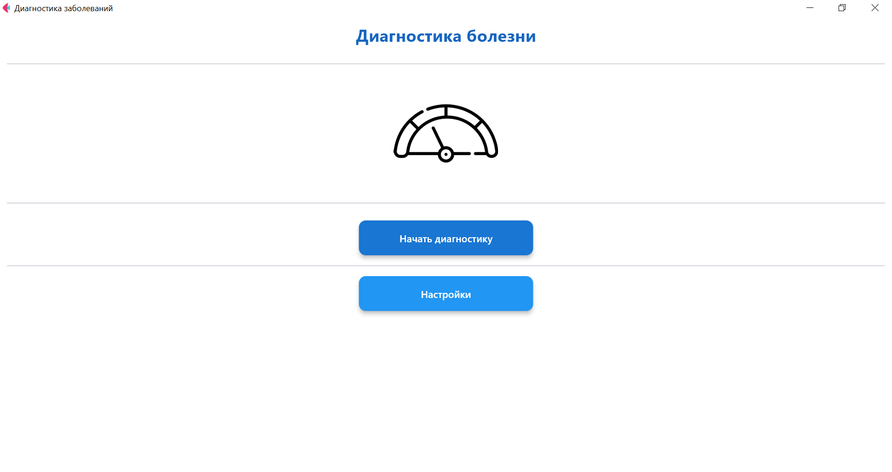
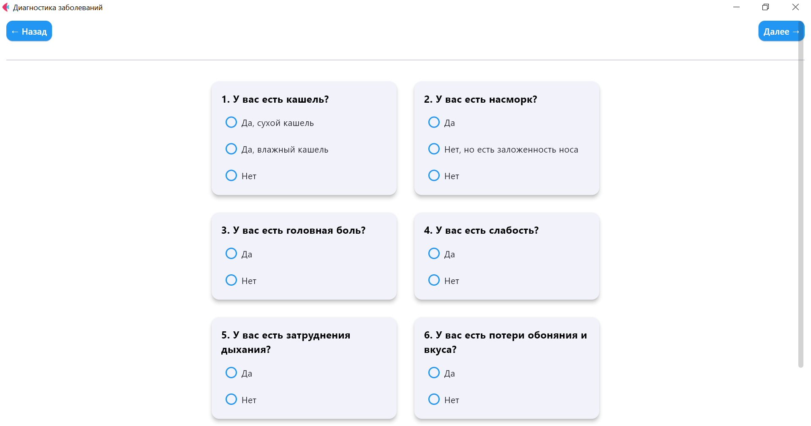

# 🩺 Диагностическое приложение заболеваний

Приложение для диагностики вероятных заболеваний на основе введенных симптомов с визуализацией результатов в виде круговой диаграммы.

## 📋 Краткое описание:
Пользователь вводит свои симптомы и признаки, а программа анализирует введённую информацию и выдает вероятность наличия тех или иных заболеваний.  

## 🧩 Суть проекта:
Создание интерактивного приложения, которое поможет пользователю понять, какие заболевания могут быть связаны с его симптомами. 

## 🎯 Цель проекта:
Обеспечить пользователей инструментом для самодиагностики и повышения осведомленности о своем здоровье, а также предоставить рекомендации по дальнейшим действиям, включая необходимость обращения к врачу.

## 🔥 Актуальность:
С увеличением информационной нагрузки и доступности медицинской информации многие люди стремятся получить ответы на свои вопросы о здоровье. Стремление к самопомощи и профилактике заболеваний становится более распространенным. Данная программа может быть полезной в условиях ограниченного доступа к медицинским услугам.

## ✅ Задачи:
1) Разработать алгоритм распознавания заболеваний по симптомам.
2) Создать базу данных симптомов и связанных с ними заболеваний.
3) Реализовать удобный и интуитивно понятный интерфейс для ввода данных пользователем.

## 👩‍🎨 Целевая аудитория:
- Люди, заинтересованные в своем здоровье и стремящиеся к профилактике заболеваний, желающие понять свое состояние.
- Медицинские учреждения в целях повышения осведомленности.

## 💰 Бизнес модель:
- Базовая версия приложения бесплатна.
- Размещение рекламы медицинских товаров и услуг в приложении.
- Партнерство с клиниками. Возможность направлять пользователей к партнерским медицинским учреждениям.

## 🧠 Промт инжинеринг:
Создание четких и понятных инструкций для пользователя, чтобы минимизировать путаницу и обеспечить качественный ввод данных.

## 🛠️ Как пользоваться:
**Виды окон**:

1) Главное меню  
- Если хотите начать диагностику, нажмите кнопку "Начать диагностику"  
- Ели хотите настроить интерфейс нажмите кнопку "Настройки".  

2) Опрос симптомов
- Ответьте на вопросы в 3-х колонках:
- Левая колонка: Кашель и слабость
- Средняя колонка: Насморк и дыхание
- Правая колонка: Головная боль и обоняние

3) Ввод температуры
- Укажите вашу температуру (например: 36.6)
- Нажмите "Сохранить"
- Для продолжения нажмите "Далее"

4) Просмотр результатов
- Откроется окно с круговой диаграммой вероятностей
- Максимальная вероятность выделена на графике
- Для возврата нажмите "Назад"

5) Настройки
- Измените цвет фона на:
    - Синий 🟦
    - Зеленый 🟩
    - Белый ⬜
    - Желтый 🟨
    - Красный 🟥  

## 🖼️ Скриншоты интерфейса

|   Главное меню  |   Окно диагностики  |  Результаты   |
|-----------------|---------------------|---------------|
|  |  | .png) |

## ✨ Особенности

- 📊 Интерактивный опрос по симптомам
- 🌡️ Ввод температуры тела
- 📈 Визуализация результатов (вероятности заболеваний)
- 🎨 Настраиваемый интерфейс (изменение цветовой схемы)
- 📱 Адаптивный дизайн

## 🛠 Технологии
- Python 3.12
- Flet (для GUI)
- Matplotlib (для визуализации)
- NumPy (для расчетов)

## 📌 Поддерживаемые заболевания
- ОРВИ
- Коронавирус
- Грипп
- Корь
- Пневмония
- Коклюш
- Бронхит

## 📝 Алгоритм работы
1) Пользователь отвечает на вопросы о симптомах
2) Вводит температуру тела
3) Приложение рассчитывает вероятности заболеваний
4) Результаты отображаются в виде диаграммы

## 📊 Логика расчетов
Вероятности рассчитываются на основе:
- Наличия/отсутствия симптомов
- Типа кашля (сухой/влажный)
- Температуры тела
- Других факторов (слабость, затрудненное дыхание и т.д.)

## 🌈 Цветовые темы
Доступны 5 цветовых схем:
- Синий
- Зеленый
- Белый
- Желтый
- Красный

## 🏁 Итоги проекта

### 🎯 Достигнутые результаты
- ✅ Разработан интуитивно понятный **диагностический инструмент** с GUI-интерфейсом  
- 📊 Реализована **система расчета вероятностей** заболеваний на основе симптомов  
- 🎨 Создана **интерактивная визуализация** результатов (круговая диаграмма)  
- 🖌️ Реализована **гибкая система настройки** цветовой схемы приложения  

## 📌 Вывод

Проект представляет собой эффективный инструмент первичной диагностики, который может быть полезен:
- В домашних условиях для самодиагностики
- В медучреждениях как вспомогательная система
- В образовательных целях для изучения симптоматики

Лучшая диагностика — это профилактика. Данное приложение помогает вовремя обратить внимание на тревожные симптомы.
